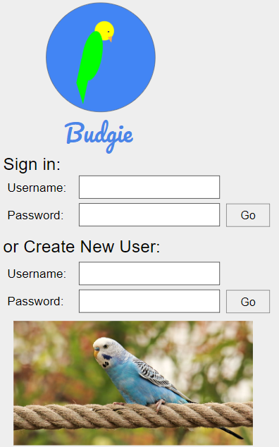
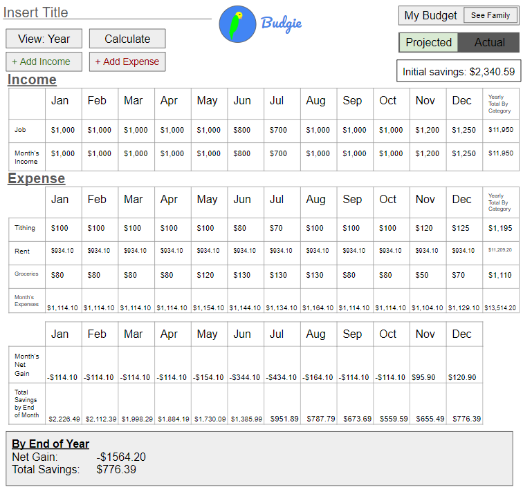
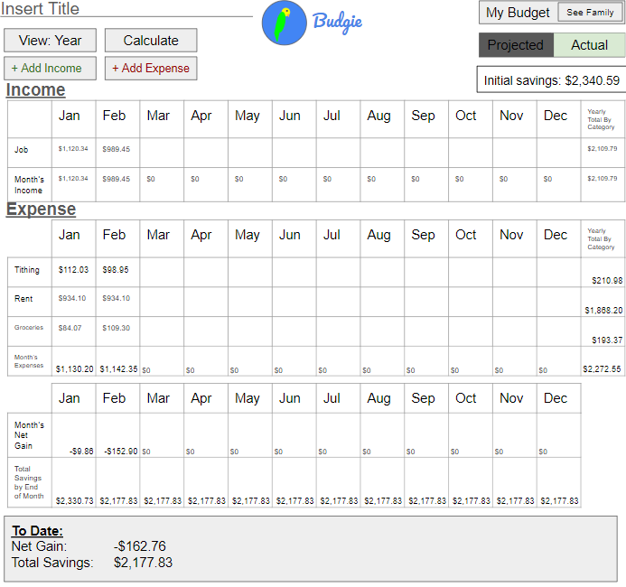
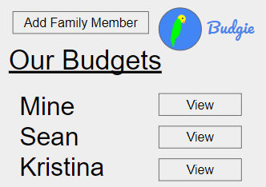

# Budgie
## Specification Deliverable:
### Elevator pitch:
When you're finally out of the house on your own, it's important to make sure your finances are straight to avoid getting yourself into trouble. Budgie, the budgeting application, is a simple tool for helping you keep track of your income and expenses in an organized manner. Budgie allows you to set a plan of your projected income and expenses as well as functionality to track how you're doing at keeping up to your plan. Have kids that want to learn to manage their money? You can see their plan and how well they're keeping up at it. No more manually making spreadsheets -- get that peace of mind of a budget that is simple to create and accessible from anywhere.

### Design
**Login Page:**

**Projected Page:**

**Actual Page:**

**Family Page:**

### Key Features
- Create an account / login
- Two Budgets: Projected budget and actual budget
- Add sources of income / expenses
- Edit each category in the table
- Change the view to see from a month to a year at a time
- Net Gain/Loss and Total Savings calculated and displayed
- See budgets of other users (if they accept)
- Budgets are persistently stored for each user

### Technology
Here's how the technology will be used:
- **HTML** - HTML will provide structuer for the pages. 4 HTML pages: Login, Projected Budget, Actual Budget, and Family page
- **CSS** - Make application work with different screen sizes, use of color, decorating login screen
- **JavaScript** - Adds functionality to buttons, performs calculations, calls APIs, provides login
- **Web Service** - Login service, Bird images inserted through an API for the login screen, if I can get it to work (and if it's legal) I'll try to pull info directly from the user's bank to auto-populate the Actual Budget
- **Database/Login** - Store users, potential budgets, and actual budgets in database. Create an account and login users. Store credentials securely in database. Can't proceed to budget pages without logging in.
- **WebSocket** - Access to other accounts and chatting
- **React** - React will be used for web framework

## HTML Deliverable
- **HTML pages** - Added 6 HTML pages: logging in, creating a new user, viewing a potential budget, viewing an actual budget, interacting with other users, and an about page.
- **HTML tags** - Yes, I used these.
- **Links** - Login links to Projected and New User. New User links to Projected. Projected links to Actual and Group. Actual links to Group. The navigation bar present in all pages links to Login, Projected, Group, and About.
- **Text** - Each HTML page has text in it, used to represent financial categories, months, messaging conversations, about info, etc.
- **Service calls** - Bird images to be pulled from bird API.
- **Images** - Budgie logo and ico file on all pages. Images on Login, New User, and About pages.
- **Login** - Login button, input boxes for username and password on Login and New User pages.
- **Database** - Actual and Projected pages contain placeholder information that would be stored and pulled from a database.
- **WebSocket** - Placeholder conversation in Group page for messaging and requesting access to each other's budgets.

## CSS Deliverable
- **Header, footer, and main content body** - Implemented
- **Navigation elements** - Nav bar is now styled, all links are also stylized
- **Responsive to window resizing** - Use of flex on every page instead of absolute so content can be viewed on devices with different screen sizes
- **Application elements** - All buttons and dropdowns are styled with Bootstrap. Elements are appropriate centered on the screen.
- **Application text content** - Use of two different fonts (one for navbar and one for all other text), some text bolded
- **Application images** - All images put in a frame with corners rounded

- Header, footer, and main content body
- Navigation elements - I dropped the underlines and changed the color for anchor elements.
- Responsive to window resizing - My app looks great on all window sizes and devices
- Application elements - Used good contrast and whitespace
- Application text content - Consistent fonts
- Application images - Still don't have images and so no styling here. 😔