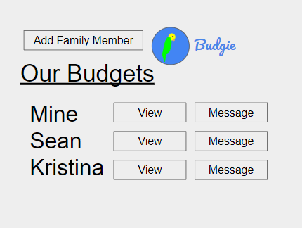

# Budgie
## Specification Deliverable:
### Elevator pitch:
When you're finally out of the house on your own, it's important to make sure your finances are straight to avoid getting yourself into trouble. Budgie, the budgeting application, is a simple tool for helping you keep track of your income and expenses in an organized manner. Budgie allows you to set a plan of your projected income and expenses as well as functionality to track how you're doing at keeping up to your plan. Have kids that want to learn to manage their money? You can see their plan and how well they're keeping up at it. No more manually making spreadsheets -- get that peace of mind of a budget that is simple to create and accessible from anywhere.

### Design
**Login Page:**

**Projected Page:**

**Actual Page:**

**Family Page:**

### Key Features
- Create an account / login
- Two Budgets: Projected budget and actual budget
- Add sources of income / expenses
- Edit each category in the table
- Change the view to see from a month to a year at a time
- Net Gain/Loss and Total Savings calculated and displayed
- See budgets of other users (if they accept)
- Budgets are persistently stored for each user

### Technology
Here's how the technology will be used:
- **HTML** - HTML will provide structuer for the pages. 4 HTML pages: Login, Projected Budget, Actual Budget, and Family page
- **CSS** - Make application work with different screen sizes, use of color, decorating login screen
- **JavaScript** - Adds functionality to buttons, performs calculations, calls APIs, provides login
- **Web Service** - Login service, Bird images inserted through an API for the login screen, if I can get it to work (and if it's legal) I'll try to pull info directly from the user's bank to auto-populate the Actual Budget
- **Database/Login** - Store users, potential budgets, and actual budgets in database. Create an account and login users. Store credentials securely in database. Can't proceed to budget pages without logging in.
- **WebSocket** - Access to other accounts and chatting
- **React** - React will be used for web framework

## HTML Deliverable
- **HTML pages** - Added 6 HTML pages: logging in, creating a new user, viewing a potential budget, viewing an actual budget, interacting with other users, and an about page.
- **HTML tags** - Yes, I used these.
- **Links** - Login links to Projected and New User. New User links to Projected. Projected links to Actual and Group. Actual links to Group. The navigation bar present in all pages links to Login, Projected, Group, and About.
- **Text** - Each HTML page has text in it, used to represent financial categories, months, messaging conversations, about info, etc.
- **Service calls** - Bird images to be pulled from bird API.
- **Images** - Budgie logo and ico file on all pages. Images on Login, New User, and About pages.
- **Login** - Login button, input boxes for username and password on Login and New User pages.
- **Database** - Actual and Projected pages contain placeholder information that would be stored and pulled from a database.
- **WebSocket** - Placeholder conversation in Group page for messaging and requesting access to each other's budgets.

## CSS Deliverable
- **Header, footer, and main content body** - Implemented
- **Navigation elements** - Nav bar is now styled, all links are also stylized
- **Responsive to window resizing** - Use of flex on every page instead of absolute so content can be viewed on devices with different screen sizes
- **Application elements** - All buttons and dropdowns are styled with Bootstrap. Elements are appropriate in line on the screen and don't look weird. Background color applied appropriately.
- **Application text content** - Use of two different fonts (one for navbar and one for all other text), some text bolded
- **Application images** - All images put in a frame with corners rounded

## JS Deliverable
- **JS support for future login** - Can create a new user and log in with an existing user. Access to Home or budget pages is prevented without signing in.
- **JS support for future database data** - Login credentials, messages, friends, friend requests, budget requests, permitted budgets, and budget data (income, expenses, privacy setting) are stored in localStorage.
- **JS support for future WebSocket** - Can send messages to friends. A placeholder friend account is automatically generated and sends messages on an interval.
- **JS support for application's interaction logic** - Can create a new user and log in with an existing user. Functionality added to create new budgets and rename or delete existing budgets. Can send friend requests, accept or reject friend requests, send messages to friends, request permission to see a friend's public budget, grant or deny permission to incoming budget access requests, and view friends' budgets that have been permitted. In the Budget view, can create new budget fields (income or expenses), edit the corresponding values for the fields (in projected or actual), and edit the initial amount. Calculations for sums are performed correctly, saved, and displayed.

## Service Deliverable
- **HTTP service using Node.js and Express** - Implemented
- **Frontend served up using Express static middleware** - Yep
- **3rd party service endpoints** - Frontend calls backend (calling this API straight from the frontend yields a CORS error), which calls https://random-d.uk/api/quack and passes back a random duck image
- **Backend provides service endpoints** - In index.js, the following endpoints are implemented: Duck, New User, Login, Get User, Update User Send Friend Request, Respond to Friend Request, New Budget, Edit Budget Data, Send Message, Budget Response, and View Friend's Budget. All data submitted to the user is stored in a Map called `users` as a placeholder for MongoDB.
- **Frontend calls backend's service endpoints** - Login page calls the Login endpoint. New User page calls the New User endpoint. Home page calls the Get User, Update User, Edit Budget Data, Send Friend Request, Respond to Friend Friend Request, Send Message, View Friend's Budget, and Budget Response endpoints. Projected and Actual pages call the Update User endpoint. About page calls the Duck endpoint. All frontend calls to endpoints are done using `fetch`.

## Login Deliverable
- **New User Registration** - Can register a new user with username and password. Upon registration an auth token is set as a cookie in the user's browser. Cannot register with a username that has already been taken.
- **Existing User Authentication** - Can login with existing username and password. Also receives an auth token.
- **Application Data Stored in MongoDB** - UserData (budgets, friends, friend requests, budget requests, messages) stored and updated in MongoDB.
- **Credentials Stored and Retrieved in MongoDB** - AuthData (username, password, authToken) stored in MongoDB and queried to verify inputted credentials / auth tokens. Passwords are hashed before storage using Bcrypt.
- **Application Functionality Restricted Based on Authentication** - Kick script prevents you from accessing Home, Projected, or Actual pages without a valid auth token. All data-accessing endpoints that do not create an auth token return an error for an invalid auth token. Logging out removes the auth token in the browser.

## WebSocket Deliverable
- **Backend listens for WebSocket connection** - Yep (in websocket.js)
- **Frontend makes WebSocket connection** - Yep (all in home.js)
- **Data sent over WebSocket connection** - Yep
- **WebSocket data displayed in the application interface** - Sending and accepting friend requests, sending and accepting / rejecting budget requests, and sending messages are all displayed in realtime.